# ⛰️ Oneblock Ultimate

**The ultimate version of the Oneblock Minecraft gamemode.**

  
Special Thanks

  I want to give special credit to [BPR02](https://github.com/BPR02) — the creator of the [Vanilla One Block](https://modrinth.com/datapack/vanilla-one-block) datapack that inspired this project. His work helped shape the foundation of this datapack.  
  Thank you! ❤️

Start with a single block, expand your world, explore new biomes and dimensions, and collect every block in the game! 🌍  

This datapack adds **extra features** that allow you to **beat the game** and obtain **every single obtainable item**.  
But... *how is this possible?* 🤔

By adding **special (and challenging) mechanics, recipes, drops and trades**, you’ll be able to acquire every unique and normally unobtainable item in Vanilla Minecraft.

## 📚 Table of Contents
- [Mechanics](#mechanics)
  - [Lava](#lava)
  - [Curing Piglin Zombification](#curing-piglin-zombification)
  - [Resetting Trial Chamber Vaults](#resetting-trial-chamber-vaults)
- [Structures](#structures)
- [Recipes](#recipes)
- [Drops](#drops)
- [Trades](#trades)
- [Sniffers](#sniffers)
- [Starter Help](#starter-help)
- [Additional Features](#additional-features)
- [Credits](#credits)

## ⚙️ Mechanics

### 🔥 Lava

You can obtain **lava** similarly to how you obtain clay from mud and pointed dripstone: 

- Place an **empty cauldron** below a **pointed dripstone**.  
- Place a **magma block two blocks above** the dripstone.  
- **Over time** (and with the player nearby), the magma blocks will randomly transform into **netherrack**, and the **cauldron below** will fill with **lava**.

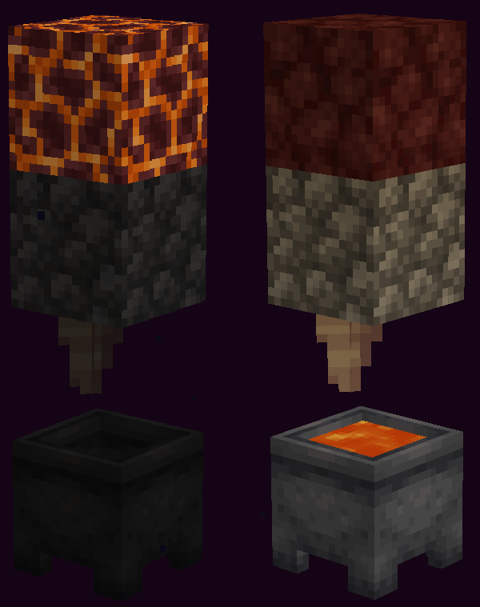

⚠️ Only work's in the nether

### 🐷 Curing Piglin Zombification

You can **cure a zombified piglin** similarly to how you cure a zombie villager:

1.  Apply **Weakness** to the **Zombified Piglin**.  
2.  Drop a **Golden Carrot** near it and wait for it to pick it up.  
3. ⏳ Wait about **30 seconds** for the curing process to finish.

  
  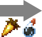
  

✅ You can do this in any dimension. 

⚠️ However, **piglins outside the Nether** don’t last long before turning back into zombified piglins.

### 🗝️ Resetting Trial Chamber Vaults

You can reset trial chamber vaults simply by standing directly above them.
This causes the vault to return to its unopened state, allowing you to use keys on it again.

✅ Lets you repeat vault rewards as needed. 

⚠️ Ensure your player hitbox is positioned directly over the vault for the reset to trigger.

## 🏰 Structures
The following **unique structures** exist only once in the world:

- **Overworld:**
  - Geode: 1 Budding Amethyst.
  - Stronghold: End portal frame.
  - Trial Chambers: 4 Trial Spawners, 1 Vault, 1 Ominous Vault.
  - Swamp Hut: 1 Spruce Planks in a 8x8x8 bounding box.
  - Pillager Outpost: 1 Birch Planks in a 16x16x16 bounding box.
  - Monument: 1 Prismarine in a 16x16x16 bounding box.
  - Mansion: Small jail made of Dark Oak blocks with 4 allays in a 16x16x16 bounding box.
  - Ancient City: 1 Sculk Shrieker.
- **Nether:**
  - Fortress: 1 Nether Bricks in a 16x16x16 bounding box.
  - Bastion Remnant: 1 Blackstone in a 16x16x16 bounding box.  
- **End:**
  - End City: 1 Endstone, 1 Chrous Flower, 4 Shulker and 1 Dragon Head in a 16x16x16 bounding box.  

## 📜 Recipes

  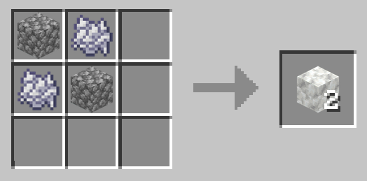
  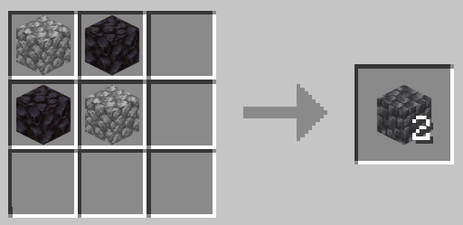
  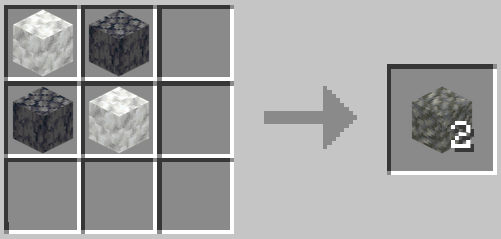
  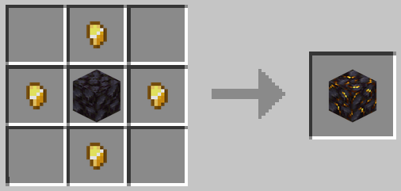
  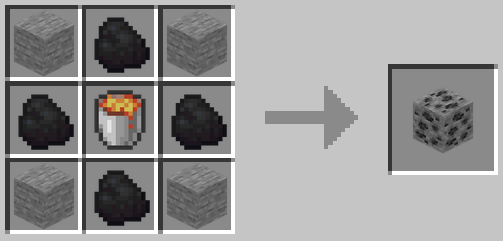
  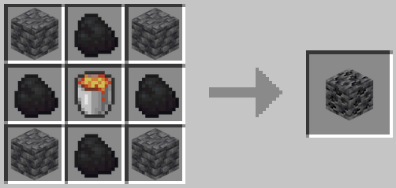
  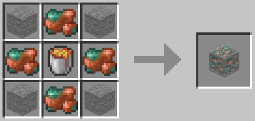
  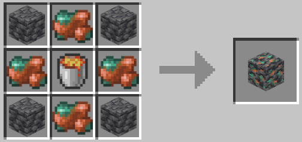
  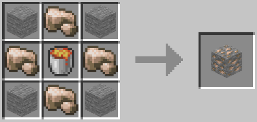
  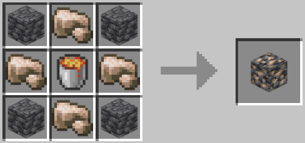
  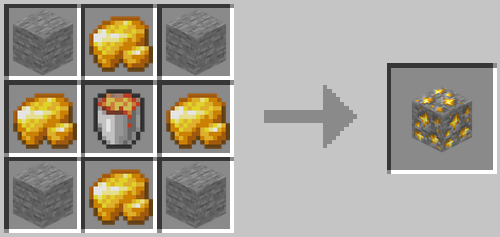
  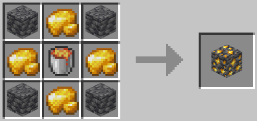
  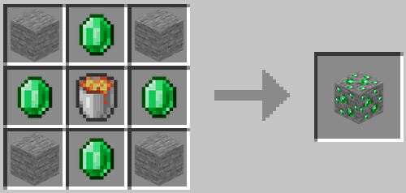
  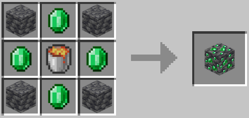
  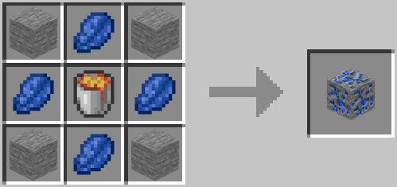
  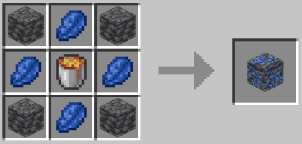
  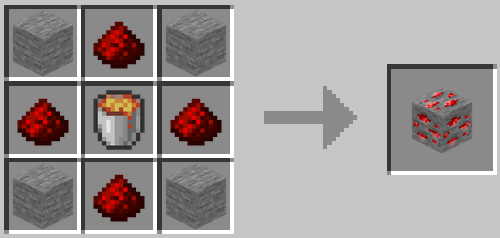
  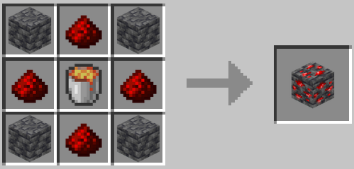
  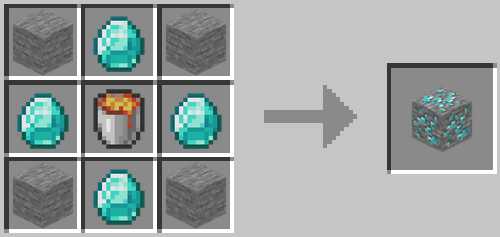
  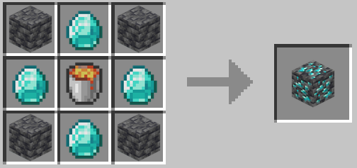
  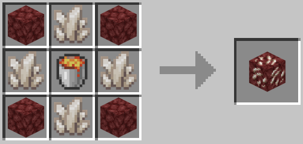
  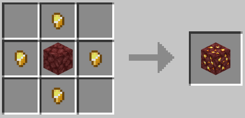
  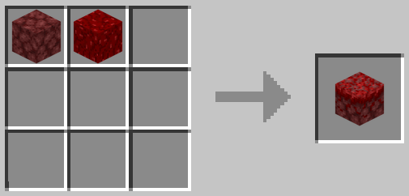
  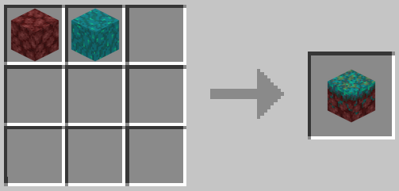
  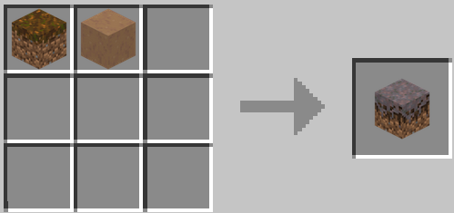
  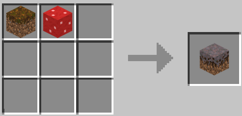
  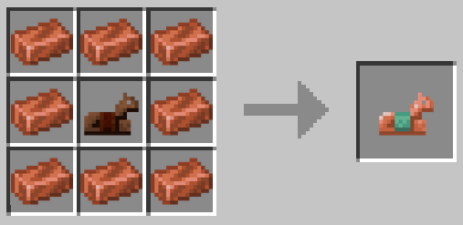
  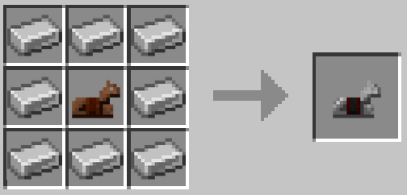
  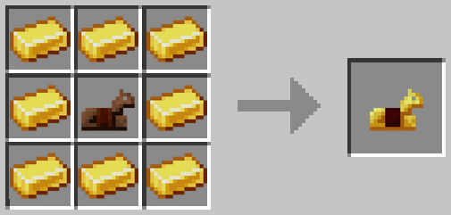
  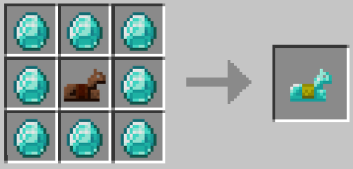
  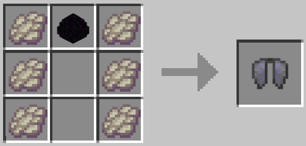
  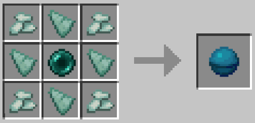

## 💎 Drops

| Mob | New Drops |
|:---:|:---:|
| Zombie    | Raw iron    |
| Drowned    | Raw copper    |
| Zombified Piglin    | Raw gold    |
| Wither    | Ancient debris    |
| Warden   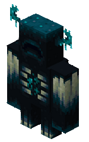 | Disc fragment, Echo shard     |
| Piglin Brute    | Netherite upgrade    |
| Pillager    | Sentry armor trim    |
| Evoker    | Vex armor trim    |
| Cave Spider    | Cobweb    |

## 💰 Trades

| Mob | New Trades |
|:---:|:---:|
| Wandering trader    | Glow lichen, Bush, Sniffer egg, Resin clump, Spore blossom, Glow berries, Sweet berries, Lilac, Peony, Rose Bush, Sunflower             |
| Piglin    | Nether wart    |

## 🐾 Sniffers
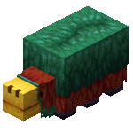

Sniffers can **search for items** in certain biomes or dimensions.  

⚠️ Ensure the Sniffer is placed over **Sniffable blocks** for it to work properly.

| Item | Biomes |
|:---:|:---:|
| Suspicious gravel   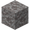 | Cold ocean, Deep cold ocean, Deep frozen ocean, Deep lukewarm ocean, Deep ocean, Frozen ocean, Lukewarm ocean, Ocean, Warm ocean |
| Suspicious sand   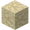 | Desert, Beach, Snowy beach |
| Coast armor trim    | Beach |
| Dune armor trim    | Desert |
| Wild armor trim    | Jungle |
| Eye armor trim    | Dripstone caves |
| Music disc creator (Music box)    | Lush cave |
| Silence armor trim, Ward armor trim, Music disc otherside      | Deep Dark |
| Rib armor trim, Snout armor trim, Music disc pigstep      | Nether |
| Spire armor trim    | End |

## 🎯 Advancements

  
SPOILER: Click to expand

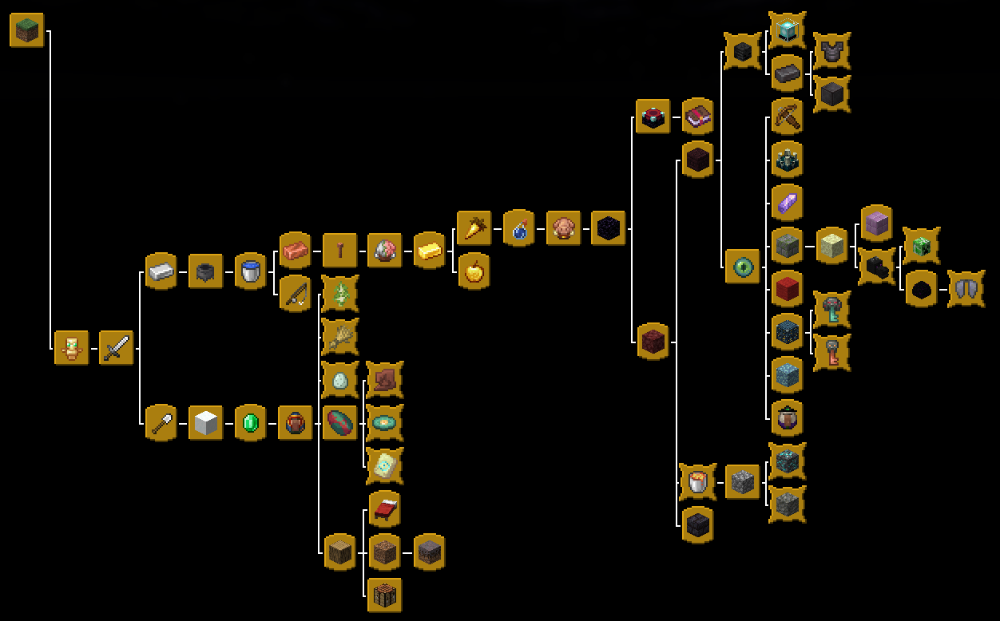

| Advancement | Requirement / Description | Flavor Text |
|------------|----------------------------|--------------|
| Absolute Flex | Obtain full netherite armor | Now you are literally unstoppable… kind of |
| Ancient Dumpster Diver | Obtain all pottery sherds | You’ve recovered every ancient fragment. Please wash your hands |
| Arborist’s Pride | Obtain all types of wood | You can now make every stick imaginable |
| Arcane Ikea | Craft an enchantment table | Assembly required. Magic sold separately |
| Arrow Factory | Go to the Pillager outpost | Where the locals shoot first and ask questions later |
| Big Brain Moves | Open an ominous vault | Danger? Sure. Loot? Probably |
| Blaze Boulevard | Go to the fortress | Fireballs incoming. Very hot |
| Block of Forever | Obtain obsidian | It’s dark, it’s strong, and it ruins pickaxes |
| Bone Collector | Kill a wither | You just made the world angrier. Congrats |
| Bunny Bribe | Craft a golden carrot | Delicious, even a zombified piglin would take one of these |
| Cheating the Mine | Craft all ores | Digging? Never heard of her |
| City of Screams | Go to the ancient city | Where we’re going, we won’t need eyes to see |
| Crystal Collector | Go to the geode | Bling for your block. Shine responsibly |
| Dirty Fungus | Craft Mycelium | Congratulations, you’ve perfected dirty alchemy |
| Dragon’s Playground | Go to the end | You’ll see the final boss… and maybe regret it |
| Economy Speedrun | Obtain emerald | Welcome to capitalism: OneBlock edition |
| Endgame Prep | Go to the stronghold | One block, many Ender Eyes… and now a portal |
| Faces of Your Enemies | Obtain all heads | Every head, proudly displayed. Therapy might be cheaper |
| Falling with Style | Die | Your sacrifice will make zombies spawn. Probably |
| Fancy Rust | Obtain copper | Shiny, conductive… you can probably zap something with this |
| Farmhand Supreme | Obtain all crops | Congratulations, you’re a OneBlock horticulturist |
| First Victim | Kill a mob | Finally, someone that's not you dies |
| Fish a Fish | Fish something with the rod | Fishing on one block. Totally normal behavior |
| Flying Loot | Go to the end city | Shulker shells and pride |
| Golden Opportunity | Obtain gold | Shiny metal acquired. Piglins are already screaming |
| Haunted Real Estate | Go to the mansion | Home sweet haunted home |
| Hold My Tears | Craft a cauldron | Soon, you’ll realize the sky is your supplier |
| Horizontal Recharge | Sleep on a bed | You can lie down… and ignore your floating block problems for a while |
| Hot Asset | Obtain lava | Skyblock starts here |
| Irony of Survival | Obtain iron | Something tells me this could bubble into greatness |
| Light Show | Light a full beacon | Everything looks cooler with beams. Even dirt |
| Liquid Asset | Obtain water | One drop at a time, the empire hydrates |
| Love in Blocks | Breed all passive mobs | You’ve now created life… in a small, cubical ecosystem |
| Magical GPS | Obtain an eye of ender | Now you can wander aimlessly toward the stronghold |
| Mercantile Mayhem | Trade with a piglin | You just bought something with gold. Hope it was worth it |
| Mother of All Blocks | Obtain a dirt block | Congratulations, it’s everywhere… just not here |
| Music Maestro | Obtain all music discs | A full collection of melodies to distract you from the void below |
| Oneblock Ultimate | Start your journey in OneBlock Ultimate! | — |
| Peak Performance | Kill the ender dragon | Congratulations, you broke the game… slightly |
| Piglin Pain | Kill a zombified piglin | You punched the wrong pig |
| Piglin Party | Go to the bastion remnant | Gold won't save you here |
| Premium Scrap | Obtain netherite | Four scraps, four gold, one panic attack |
| Professional Therapist | Heal a villager | Free them from pain... but not from working |
| Pure Flex | Craft a netherite block | You made this solely to brag. Fair |
| Rock On | Obtain cobblestone | Your empire now has a foundation… kind of |
| Shiny Words | Enchant something | You put sparkly text on an item. Science! |
| Shovelized! | Obtain a shovel | You’ve acquired the holy artifact. Time to farm the sky |
| Sniff It | Obtain a sniffer egg | Time to sniff the void? |
| Snow Way Out | Craft a snow block | Congratulations! You can now turn weather into infrastructure |
| Storm Prepper | Craft a lightning rod | Now you can summon thunderstorms. Probably on accident |
| Table of Wonders | Craft a crafting table | You can now make tools without crying |
| Test of Patience | Go to the trial chambers | Hope you like puzzles, traps, and frustration |
| Thief Starter Pack | Open a vault | Steal… or just admire the loot from afar |
| Too Much sTuff | Craft Tuff | Congratulations: You turned leftovers into geological disappointment |
| Tree Liberation | Obtain wood | Freedom for wood, one block at a time |
| Trim Collector | Obtain all types of armor trims | Now your armor can be judged as harshly as your floating block skills |
| Trophy of Defiance | Obtain the dragon egg | Very nice and that, but now what do we do with it? |
| Underwater Madness | Go to the ocean monument | The driest ocean monument awaits! |
| Vacation in Fire | Go to the nether | Sunscreen won’t help |
| Wandering Business | Make a trade | You survived the trader's nonsense... and actually got something |
| Wings of Freedom | Obtain the elytra | The sky’s the limit… but your platform isn’t |
| Witch Hunt | Go to the swamp hut | She’s brewing… and she’s mad |
| Zombie Doctor | Heal a zombified piglin | You’re basically the OneBlock medic now |

## 🛠️ Starter Help

This package includes the starter help from Vanilla One Block to speed up the initial grind.
The following features will apply until a player obtains an iron shovel.

- Over 80% of hostile mobs that spawn will be zombies.
- All zombies will spawn with iron shovels, which will have a 80% chance of dropping with at least 25% durability left (63/250).
- Jumping will cause the player to gain the Hunger effect (unless there's a zombie in the world).
- Players will be reduced to 4 hearts when starving (initial starving damage deals 6 hearts instead of half a heart of damage).
- Players will have full knockback resistance.
- Daytime will be skipped (unless there's a zombie in the world).
- Once the shovel is obtained, it will continuously rain until 23 snow blocks are placed down.

## 💡 Additional Features

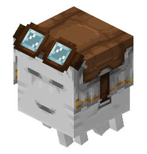

You can press the 'sprint' key (default 'L-Ctrl') while riding a Happy Ghast to make it go faster.

## 🧰 Credits

Created by BIXARDO
💬 Feedback and suggestions are welcome!

